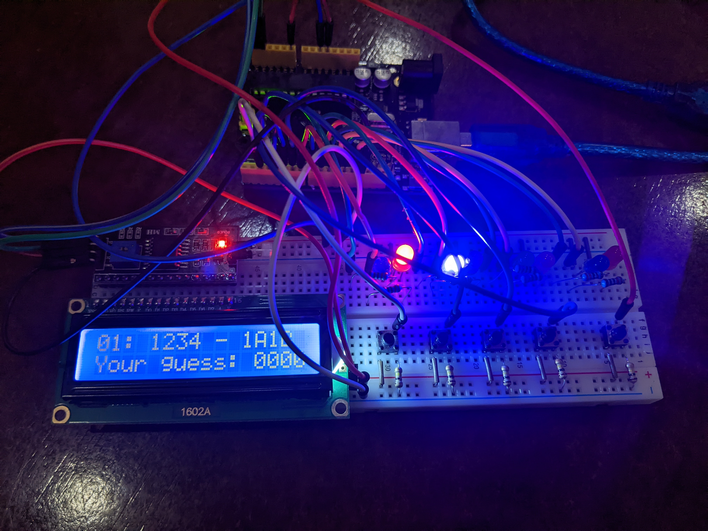
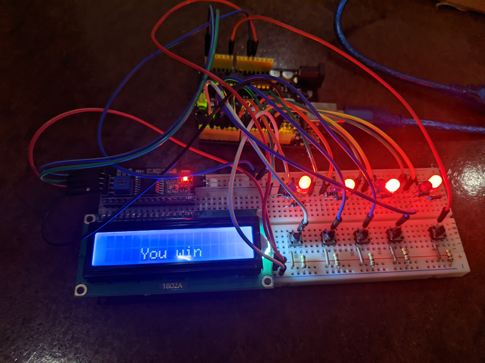

# Mastermind
Arduino implementation of the classic board game "Mastermind"

## Overview
This project is a single player Arduino implementation of the code-breaking game "Mastermind" made using C language.

[Tinkercad arduino simulation](https://www.tinkercad.com/things/hG67JYqoJme?sharecode=8KsR5exa6jZ7liUhI_4VBR5AItPYsZVV-vwV_5I-dQ8)

[More about the original game](https://en.wikipedia.org/wiki/Mastermind_(board_game)).

## Setup

### Hardware
  - Arduio UNO R3
  - I2C LCD (16 x 2)
  - 4 red LEDs
  - 4 blue LEDs
  - 4 68 Ω resistors
  - 4 128 Ω resistors
  - 5 10 kΩ resistors
  - 5 pushbuttons

### Software
  - Arduino IDE
  - LiquidCrystal_I2C.h library

### Schematics

  - [Circuit view](images/circuit.png)

  - [Schematic view](images/schematic.pdf)

### Useful links
  
  - [I2C LCD](https://arduinogetstarted.com/tutorials/arduino-lcd-i2c)
  - [Buttons](https://www.arduino.cc/en/Tutorial/BuiltInExamples/Button)
  - [Picking resistors for LEDs](https://www.evilmadscientist.com/2012/resistors-for-leds/)

Once everything is set up connect your Arduino board to PC via USB and upload the code using Arduino IDE

## Rules

The codemaker (program) randomly generates a code of 4 digits. 

The codebreaker tries to guess the code within ten turns. Each guess is made by individually entering each digit using a corresponding button and pressing the "enter" button on the decoding board. 

Once the guess is made, the codemaker provides feedback by lighting LEDs (key pegs) on the decoding board and displaying the previous guess and guessed digits onto a 16 x 2 LCD. 

A red LED is lit for each digit from the guess which is correct and in the correct position. A blue LED indicates the existence of a correct digit placed in the wrong position. 

Once feedback is provided, another guess is made; guesses and feedback continue to alternate until either the codebreaker guesses correctly, runs out of attempts.

